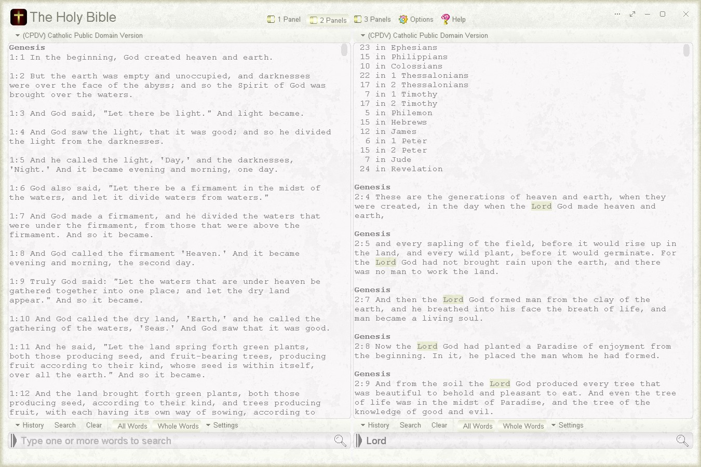
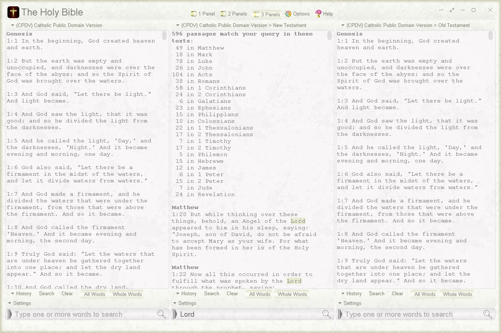
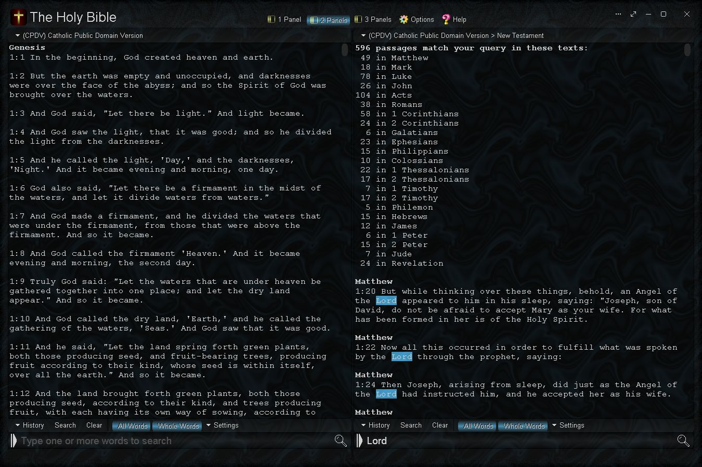
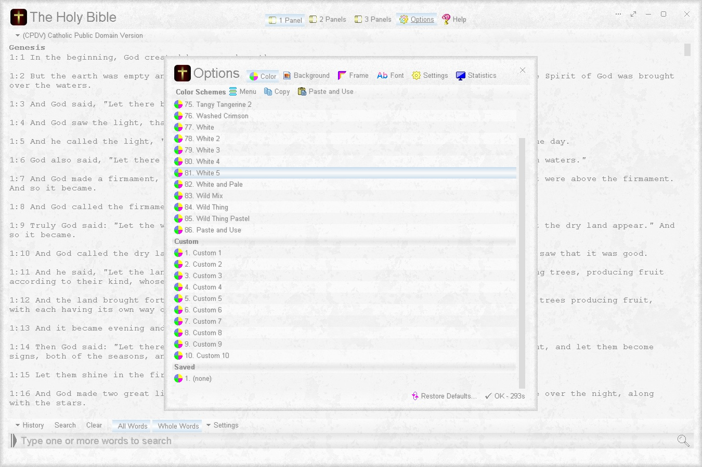

# The Holy Bible
Read and search The Holy Bible with this easy to use offline app.

# Features
* Comes with 11 built-in public domain bibles (see below)
* Use one, two, or three simultaneous search panels side-by-side
* Mark matched words by highlight, underline, bold, or turn off
* Compact option: Title and passage appear on the same line
* Read text easily in the custom text viewer
* Large, easy to use search box
* Option: Search as you type
* Search by text (book), by testament (old or new), or entire bible
* Search Options: Match all words, Match whole words
* Shared Search History: Retain and reuse your last 100 search queries from all three search panels
* History Options: Edit history and Clear history
* Fast search
* Works offline - no internet required
* Portable
* Options Window - Easily change app color, font and settings

# Comes complete with these 11 built-in public domain bibles
* (AKJV) American King James Version
* (ASV) American Standard Version
* (BSB) Berean Standard Bible
* (CPDV) Catholic Public Domain Version
* (DBT) Darby Bible Translation
* (DRB) Douay-Rheims Bible
* (ERV) English Revised Version
* (KJV) King James Bible - Pure Cambridge Edition
* (OKJV) King James Bible 1611
* (WBT) Webster Bible Translation
* (WEB) World English Bible

Three search panels in use

A dark color scheme and background scheme

Changing the color scheme via the Options window
